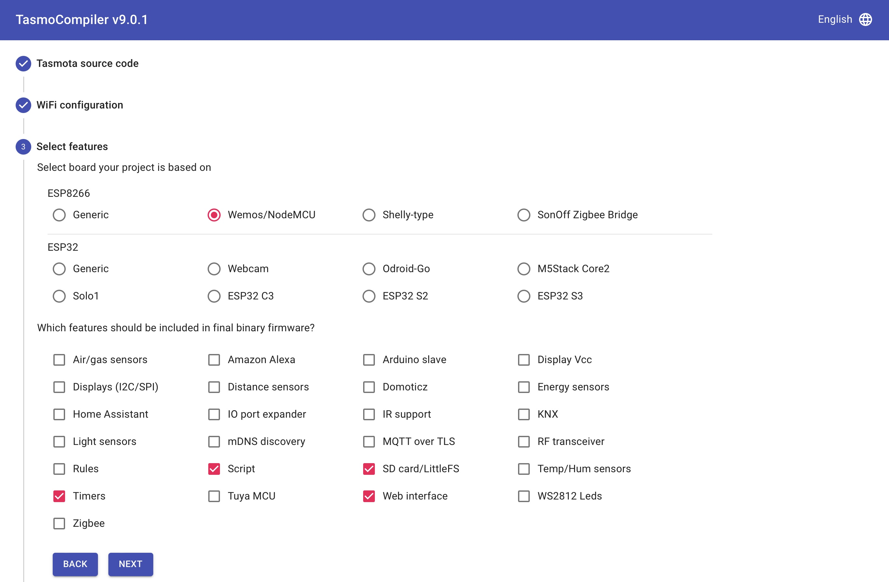

This [firmware image](tasmota4MB.bin) can be downloaded and then uploaded to your device, via OTA. 

For the interested, here follows some information about the creation process for this image.

I am using the TasmoCompiler tool. This is a web based tool and I have it running in a docker container. In case you have access to a docker environment, the setup process is very easy (my [startscript](docker-start.sh) for the container is available). Please consult the [TasmoCompiler website](https://github.com/benzino77/tasmocompiler) for further info and other installation alternatives.

Here follows a screenshot for each step of the firmware image creation process. It should be made clear about all options selected for the created image.

Build process start, advise is to always refresh the code and then go to the next step.

Select WiFi. Enter your WiFi SSID and password. In case you intend to share the built image with others, leave these inputs empty. Empty input requires a few more steps in the upgrade process, where you need to connect to he device as an AP and there enter the SSID and password for your network.

Information about the target device(s) and basic tasmota options to be included. Most importantly the Script support is selected.

Additional tasmota options to be included.

Version and language. I have used development version so far, but will probably use the latest production version soon. Pick the language that suits you best.

Build process ready and image available for download.

